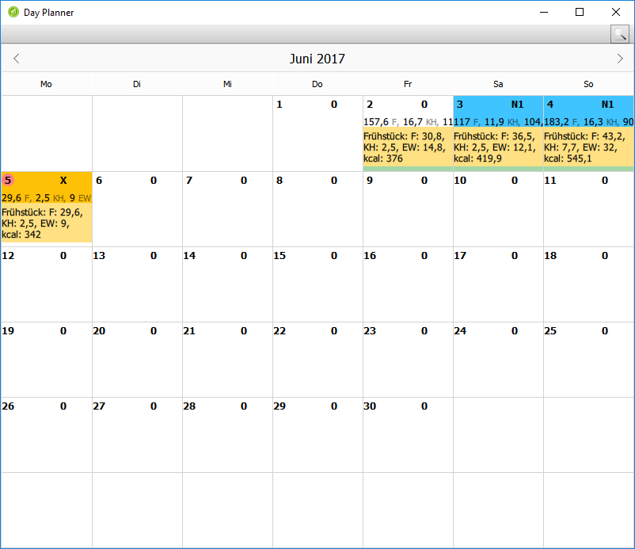
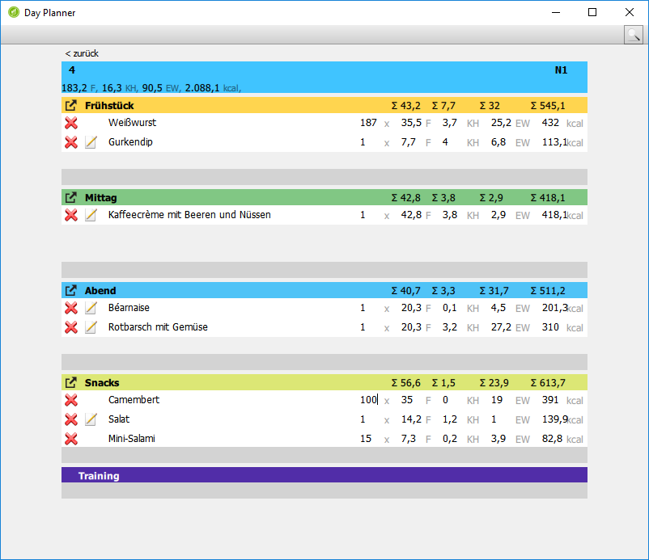
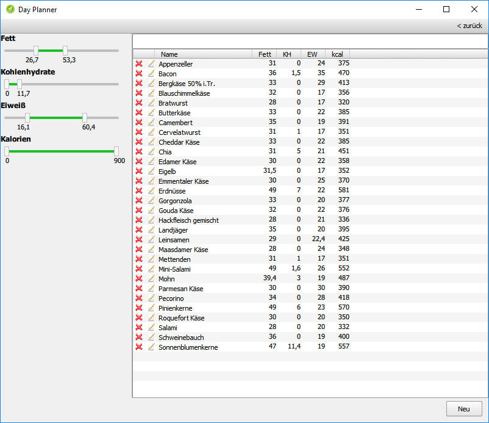
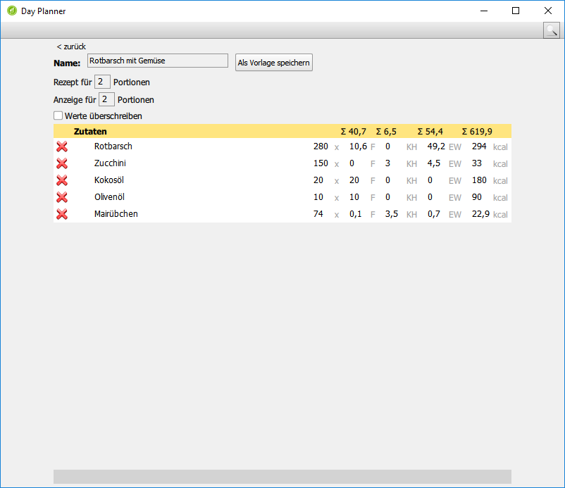

# DayPlanner
DayPlanner is a tool for support for planning of meals and exercising, developed for a frieand with Ketogenic diet in mind (but works with others as well).

It allows the enter the meals, search for ingredients, plan out and store recipes, and offers a monthly overview.

